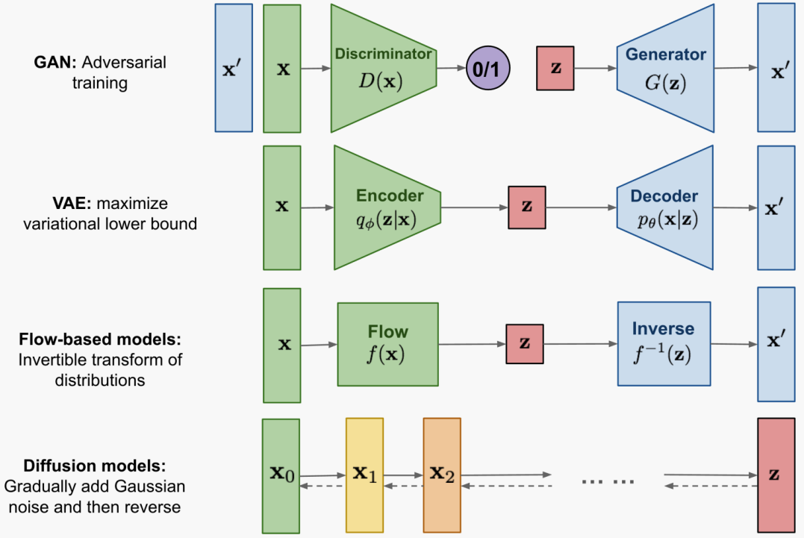
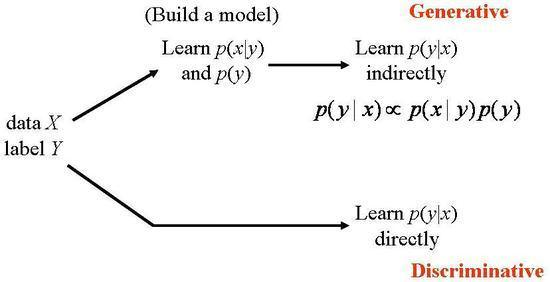
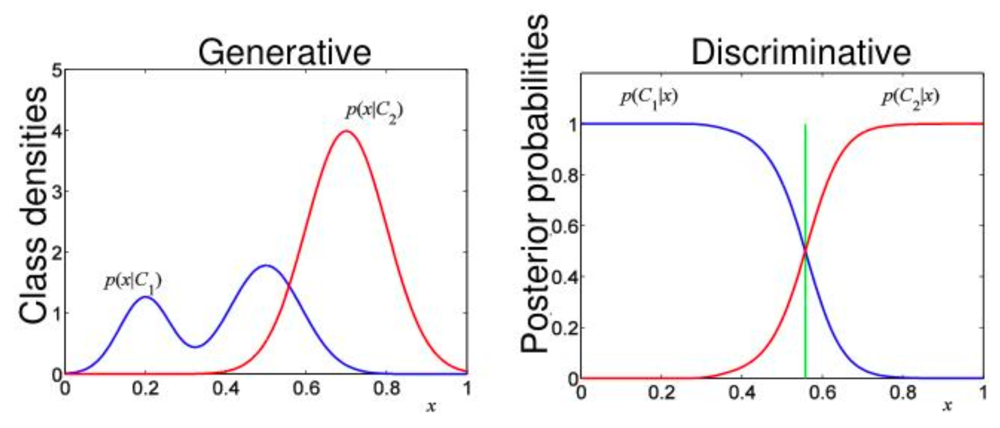

# Chapter1 - Intro

## 1. Generative Model의 종류

1. **GAN(Generative Adversarial Networks)** : GAN은 unsupervised learning problem인 data generation을 supervised problem으로 modelling하는 smart solution을 제공한다.
2. **VAE(Variational AutoEncoder)** : VAE는 Evidence Lower Bound(ELBO)를 최대화하여 data의 log-likelihood를 inexplicitly 최적화한다.
3. **Flow-based models** : Flow-based model은 일련의 가역(invertable) 변환에 의해 구성된다. 위의 두 model과 달리 data distribution p(x)를 explicitly(명시적으로) 학습하므로 loss function은 단순히 negative log-likelihood이다.
4. **Diffusion Models** : data에 noise를 조금씩 더해가거나 noise로부터 조금씩 복원해가는 과정을 통해 data를 생성하는 model이다.

## 2. Generative Models vs. Discriminative Models

### 2.1 - Classification:
Classification을 하는 경우 위의 사진과 같이 $X$의 데이터마다 labeled class $Y$가 있다. 따라서 목적은 $P(Y|X)$를 maximize하는 $Y$를 찾는 것이다. 즉, $X$가 주어졌을 때의 Posterior 함수를 최대화시키는 것이다.

### 2.2 - Generative Models(생성 모델) :

 Generative Model의 경우 위의 Classification 문제에서 각 Class 별로 가지는 likelihood인 $P(X|Y)$와 Prior distribution인 $P(Y)$를 이용하여 Data $X$와 Class $Y$ 둘의 joint probability를 modelling한다. 이 model을 이용해 새로운 data가 어느 class인지 결정한다. Generative Model은 label이 없을 경우 joint probability $P(X,Y)$ 또는 $P(X)$를 capture한다.

 이 때, joint probability를 학습하여 기존 Data를 생성하는 model을 만들었기 때문에 Generative Model이라고 한다. ==Generative Model은 말 그대로 sample dataset을 생성할 수 있다.==

> 대표적으로 GAN, VAE, Flow-based Model, Diffusion Model이 있다.

### 2.3 - Discriminative Models(판별 모델)

Discriminative Model은 바로 $P(Y|X)$를 학습시켜 학습된 parameter를 직접 이용하여 class를 결정한다. 따라서 Discriminative Model이라 부른다. Data $X$의 class $Y$를 잘 구분하는 decision boundary를 학습하는 것이 목표이다.

> 대표적으로 linear regression, logistic regression이 있다.

- 아래 그래프는 두 model의 특징과 차이를 잘 보여준다.

  

## 3. Applications of generative models

- **Content Generation** : 이미지, 영상 등의 생성
- **Data Augmentation(data 증강)** : data의 핵심 feature는 간직한 채, noise를 더하여 dataset을 확장하는 방법이다. 따라서 적은 수의 data로 여러 data를 얻을 수 있다.
- **Anomoly Detection(이상 탐지)** : data 안에서 anomaly, outlier, abnormal과 같이 예상하지 못한 data pattern을 찾아내는 것이다.
- **Representation learning** : data만 제공하면 data로부터 핵심 정보를 추출하고, 이를 기계 스스로 배우는 학습 과정이다.
- **Inverse Problem** : 결과로부터 원인을 계산하는 문제이다.