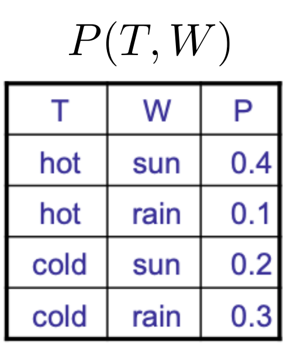
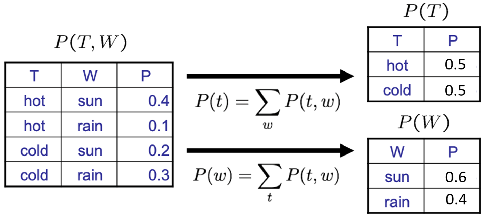
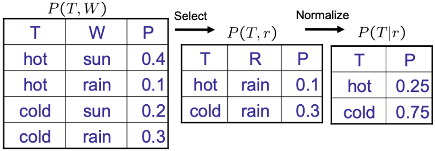

## 1. Parametric models vs. Nonparametric models

### 1.1 - model parameter(매개변수)

- model parameter : model 내부에 있고, data에서 값을 추정할 수 있는 구성 변수이다. 학습을 통해 update한다.

### 1.2 - Parametric model(모수적 모형)

- Parametric model : model이 **고정된 개수**의 **parameter**를 가지고, data가 특정 distribution을 따른다고 가정한다.
    - 장점 : 효율적이다.(빠르게 사용할 수 있다.)
    - 단점 : data distribution의 본질에 대한 더 강한 가정을 만들기 때문에 덜 유연하다. 따라서 간단한 문제를 푸는 데 더 적합하다.
    - ex) linear regression, logistic regression, Naive Bayes, Ridge regression, SVM(w/o kernel or linear kernel), Polynomial regression

### 1.3 - Nonparametric model(비모수적 모형)

- Nonparametric model : model이 training data에 따라 **parameter의 개수**가 **증가**하고, data가 특정 distribution을 따른다는 가정이 없다.
    - 장점 : data가 특정 distribution을 따른다는 가정이 없어 유연하고, complex pattern을 파악할 수 있다.
    - 단점 :  속도가 느린 경우가 많고(=비싸다), 더 많은 data를 필요로 하는 경우가 있다(=poor scalability).
    - ex) KNNs, Kernel regression, Kernel density estimation, Decision Tree, RF, SVM(w/ nonlinear kernel)

## 2. Probability

### 2.1 - Random Variable(확률 변수)

- Random variable : 불확실성(uncertainty)을 가질 수 있는 세계의 일부 측면(aspect), 즉 확률에 따라 변하는 값이다. (e.g. R=Is it raining?)
  
    보다 엄밀히 말하면 확률실험을 했을 때 발생할 수 있는 결과(possible outcomes, $\Omega$)를 실수값(measurable space, $E$​)로 대응시키는 함수이다.
    
$$
X : \Omega \rightarrow E
$$
    
    - Random variable은 알파벳 대문자로 쓰인다. (e.g. X)
    - Random variable은 domain이 있다. (e.g. R in {true, false})
    
    > Random variable은 **measurable function**이다.
- Probability distribution : random variable의 모든 값과 그에 대응하는 확률들이 이루는 distribution
    - discrete random variable의 distribution은 table로 나타난다.
    - 확률은 scalar이다.
    - $\forall x,\; P(X=x)\geq 0 \;and\; \sum\limits_x P(X=x)=1$
- Probability function : random variable에 의해 정의된 실수를 확률에 대응시키는 함수

### 2.2 - Joint Distribution

- Joint Distribution : 두 개 이상의 random variable의 set을 실수에 대응시킨다.
    - $P(x_1,x_2,\dots,x_n)\ge0 \;and\; \sum\limits_{(x_1,x_2,\dots,x_n)}P(x_1,x_2,\dots,x_n)=1$
      
        
    
- Probabilistic Model(확률 모델)은 관심 변수에 대한 joint distribution이다.
    - 모든 분포에 대해 다 구하는 것은 비현실적이다.

### 2.3 - Event(사건)

- outcome : 모든 변수에 대한 joint assignment, $(x_1,x_2,\dots,x_n)$
- Event($E$) : outcome들의 set, 표본공간의 subset이다.
    - $P(E)=\sum\limits_{(x_1,x_2,\dots,x_n)\in E}P(x_1,x_2,\dots,x_n)$

### 2.4 - Marginal distribution

- Marginalization(Summing out) : Collapsed row들을 더하여 없앤다.
    $$
    P(X_1=x_1) = \sum \limits_{x_2}P(X_1=x_1,\,X_2=x_2) 
    $$
    
- Marginal Distribution : variable을 제거한 sub-table이다.
  
    

### 2.5 - Conditional probability
- Conditional probability$P(A|B)$ : 사건 $B$가 일어났다는 조건 아래 사건 $A$의 확률
  
    $$
    P(A|B) = \frac{P(A,B)}{P(B)}
    $$
    
    
    
- Normalization Trick : 전체 Conditional Distribution을 얻기 위한 과정
  
    1. 주어진 Evidence와 대응하는 joint probability들을 선택
    2. Normalize (합을 1로 만든다.)
       
        
        

### 2.6 - Probabilistic Inference(확률적 추론)

- Probabilistic Inference : 다른 known probabilities로부터 원하는 hidden variable의 확률(belief)를 계산하는 방법이다. (e.g. joint로부터 conditional)
  
    ex) observable evidence(물웅덩이)를 보고 hidden variable(비)의 확률을  알아내는 것
    
- Inference by Enumeration(열거) : probability table이 있다고 가정할 때, 알고 있는 evidence 중 원하는 사건을 선택한다. 이후 hidden variable을 없애기 위해 Marginalization한 후, Normalize한다.
    - ex) $P(W=sun|winter,hot)$ 구하기
      
      
      
        1. evidence (winter, hot)에 해당되는 row만 선택한다.
        2. hidden variable이 없으니 바로 normalization한다.
      
        ⇒ $P(sun|winter,hot)=0.1/0.15=0.67$
      

### 2.7 - Product rule

- Product rule : Conditional probability와 marginal probability의 확률을 곱하면 joint probability이다.
  
    $$
    P(x,y) = P(x|y)P(y)\; \Longleftrightarrow \;P(x|y)=\frac{P(x,y)}{P(y)}
    $$
    

### 2.8 - Chain rule

- Chain rule : Product rule을 일반화한 것이다.
  
    
    

### 2.9 - Bayes Theorem

- Bayes Theorem : event $e$가 원인이고, data $D$가 결과일 때, $P(e|D)$, 즉 $D$가 관측되었을 때 $e$가 일어날 확률을 추론할 수 있게 하는 식이다.
  
    Bayes Theorem을 통해 data가 관측되기 전의 prior값이 data가 주어지면서 어떻게 변하는지 계산할 수 있다. 따라서 기존의 data에 새로운 data를 반영해 최종 결과를 얻을 수 있다.
    
    ex) e = “나는 감기에 걸렸다.” /  D = “콧물”, “기침”, “발열”
    
    $$
    P(e|D)=\frac{P(D|e)P(e)}{P(D)}\quad (e:cause\, \cdot\,event , D:effect)
    $$
    
    - $P(e|D)$, `Posterior(**사후 확률**)` : data D가 관측된 후 갱신된 event E의 확률
    - $P(e)$, `Prior(**사전확률**)` : data D가 관측되기 전에 가지고 있던 event E의 확률(이미 알고 있음). 대부분의 문제에서 함수의 본 모습을 파악하는 것이 어렵다. 따라서 미리 분포를 가정한다.
    - $P(D|e)$, `Likelihood(**가능도**)` : event E가 발생한 경우 관측치 D를 얻을 확률
    - $P(D)$, `Evidence, Marginal probability(**증거**)` : D의 확률, normalizing constant

## 3. MLE vs. MAP

MLE와 MAP는 probability model을 이용하여 parameter $\theta$를 추정하는 방법이다. 두 방법 모두 full distribution을 구하지 않고 single estimate를 계산한다. (Full distribution을 구하는 것은 Generative model)

두 방법 모두 아래의 Bayes Theorem을 기반으로 하는데, 목적은 둘 다 **posterior** probability인 $P(\theta|X)$을 **maximize**하는 것이다.

$$
P(\theta|X) = \frac{P(X|\theta)P(\theta)}{P(X)}
$$

### 3.1 - MLE(Maximum Liklihood Estimation)

- MLE : `Likelihood` $P(X|\theta)$를 최대로 만드는 $\theta$를 찾는 방법이다. 아래 식에서 볼 수 있듯이 MLE는 Likelihood에 비례하기 때문에 prior distribution이 나쁠 때 사용하는 것이 좋다.

$$
\DeclareMathOperator*{\argmax}{arg\,max} 
\theta_{MLE} = \argmax\limits_{\theta}P(X|\theta)
$$

### 3.2 - MAP(Maximum A Posteriori)

- MAP : `Posterior` $P(\theta |X)$를 최대로 만드는 $\theta$를 찾는 방법이다. 과정은 아래와 같고, prior와 Likelihood에 비례한다는 것을 알 수 있다. 따라서 MAP은 prior probability$P(\theta)$가 잘 주어졌을 때 사용해야 한다.

$$
\begin{align*}\theta_{MAP} &= \argmax\limits_{\theta}P(\theta|X)=\argmax\limits_{\theta}\frac{P(X|\theta)P(\theta)}{P(X)}\\&=\argmax\limits_{\theta} P(X|\theta)P(\theta) \quad\quad\quad\quad\quad\, (P(X) \;무시)\\ &= \argmax\limits_{\theta}[\log P(X|\theta)+\log P(\theta)]\quad (log를\;취함)\end{align*}
$$

## 4. Naive Bayes Classifier

### 4.1 - Naive Bayes Classifier

- Naive Bayes Classifier : set of feature$(X_1,X_2,\dots,X_k)$가 있을 때, 이를 set of classes$\{c_j\}$ 중 most likely class로 분류하는 [Bayes Theorem](https://www.notion.so/Chapter2-Generative-Models-for-Discrete-data-e08b08daa5df4203866b25aa23ff7653?pvs=21) 기반 Classifier(class에 속할 확률을 계산한다).
    - **`Conditionally Independent`** : Naive Bayes Classifier은 class에 대해 각 feature들이 모두 conditionally independent하다는 가정 하에 확률 계산을 단순화한다.
      
        ⇒ Naive 하다.
        
        > 조건이 되는 별개의 확률변수 $Z$에 대한 $X,Y$의 조건부확률이 $Z$에 대한 $X$, $Z$에 대한 $Y$의 조건부확률의 곱과 같은 것을 말한다. 이 때, $X$와 $Y$가 $Z$에 대해 Conditionally Independent라고 한다.
        
        $$
        Conditionally\;Independent, X⫫Y|Z  \\
        \begin{align*}\forall x,y,z:P(x,y|z)&=P(x|z)P(y|z)\\&=P(x|z)P(y|x,z) \\ 
        \forall x,y,z:P(x|z,y)&=P(x|z) \\ 
        \forall x,y,z:P(y|z,x)&=P(y|z)\end{align*}
        $$
        

### 4.2 - Naive Bayes Classifier 과정

1. class $c_j$와 feature $X_i$의 joint probability는 $P(X_1,\dots,X_K,c_j)$이다. class에 대해 각 feature는 conditionally independent하기 때문에 아래와 같이 유도할 수 있다.
   
    $$
    P(X,c_j)=P(X_1,\dots,X_k|c_j)P(c_j)=P(c_j)\prod_{i=1}^k P(X_i|c_j) \\ 
    \Rightarrow P(c_j|X_1,\dots,X_k)=\frac{P(X_1,\dots,X_k|c_j)P(c_j)}{P(X_1,\dots,X_k)}
    $$
    
    - $P(c_j)$ : prior probability
    - $P(X_i|c_j)$ : conditional probability
2. 이 때, $P(X_1,\dots,X_k)$는 모든 class에 대해 동일하기 때문에, 무시할 수 있다. 따라서 최적의 $c_j$를 선택하기 위해 $P(X_1,\dots,X_k|c_j)P(c_j)$를 maximize하는 $c_j$를 선택하면 된다.
   
    $$
    \begin{align*} c_j &\leftarrow \argmax\limits_{c_j} P(X_1,\dots,X_k|c_j)P(c_j)\\ 
    &=\argmax\limits_{c_j} P(c_j)\prod_{i=1}^k P(X_i|c_j) \end{align*}
    $$
    
    - $P(c_j)=\frac{N_d(c_j)}{N_d}$        ($N_d$ : # of docs / $N_d(c_j)$ : # of docs in class $c_j$)
    - $P(X_i|c_j)=\frac{N_d(X_i,c_j)}{N_d(c_j)}$     ($N_d(X_i,c_j)$ : # of docs with $X_i$ in class $c_j$)

### 4.3 - Naive Bayes Classifier 장단점

- 장점
    - **Simple and Fast** : class에 대한 term frequency data에만 의존, 반복 없이 training dataset을 한번만 통과한다.
    - **Compact Model** : 크기는 feature와 class의 개수에 비례한다.
    - **Very well-behaved numerically** : term의 weight은 해당 term의 frequency에만 의존한다.
    - **Can work very well with sparse data** : dependent term의 조합이 rare한 data에서 잘 작동함.
- 단점
    - **Subject to error and bias** : term의 확률이 독립적이지 못할 때 오류 및 bias 발생
    - **Can’t model patterns in data**
    - **Typically not as accurate** : 위와 같은 이유로 정확성이 다른 방법보다 떨어진다.