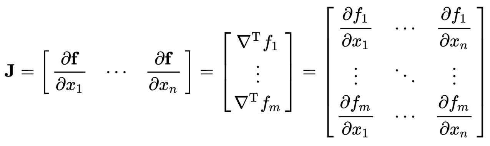

## 1. Transform for Discrete Random Variable

### 1.1 - Probability Mass Functions

- Probability Mass Functions(=PMF, 확률 질량 함수) : discrete random variable이 특정값을 가질 확률을 나타내는 함수
  
    $$
    f_X(x) = P(X=x)
    $$
    
    위 식은 확률 변수 $X$가 sample $x$를 가질 확률을 나타내는 pmf이다.
    

### 1.2 - Transform for Discrete R.V.

- Transform for Discrete R.V. : random variable $X$를 함수 $f(x)=y$를 이용하여 $Y$로 변환할 때, $Y$의 pmf를 구하는 방법이다.
  
     이 때, $X$가 discrete random variable이라면 함수 $f(x)=y$를 만족하는 모든 $x$에 대한 확률을 단순히 합해서 $y$의 pmf를 구할 수 있다.
        
    $$
    \begin{align*} P_y(Y=y)&=\sum_{x:f(x)=y}P_x(x) \\ &=P_x(f^{-1}(y)) \end{align*}
    $$
    

## 2. Transform for Continuous Random Variable

### 2.1 - Probability Density Functions

- Probability Density Functions(=PDF, 확률 밀도 함수) : countinuous random variable이 특정 값을 가질 확률을 나타내는 함수이다.
  
     그러나 PMF와 같이 정확한 sample $X=x$에서의 확률을 정의할 수 없다. 따라서 아래의 성질을 가진다.
        
    $$
    \begin{align*}\mathbb{P}_X(x) &= \int_{-\infty}^x P_X(t)dt \;\Longrightarrow P_X(x)=\frac{d\mathbb{P}_X}{dx}\\ \Pr(X=x)&=0\\ \Pr(a<X<b) &= \int_a^b P_X(t)dt \end{align*}
    $$
    

### 2.2 - Transform for Continuous R.V.

- Transform for Continuous R.V. : random variable $X$를 함수 $f(x)=y$를 이용하여 $Y$로 변환할 때, $Y$의 pdf를 구하는 방법이다.
  
    > 이 때, $f:X\rightarrow Y$는 $X$와 $Y$ 사이에 일대일 대응 관계가 성립해야 한다. 즉, $f^{-1}:Y\rightarrow X$가 존재해야 한다.
    > 
    
    $$
    \begin{align*} P_y(y)=P_x(x) \left\vert \frac{dx}{dy}\right\vert &= P_x(x) \left\vert \frac{dy}{dx}\right\vert^{-1}\\pf)\;P_y(y) = \frac{d}{dy}\mathbb{P}_y(y)&=\frac{d}{dy}\mathbb{P}_x(f^{-1}(y)) \\&=\frac{dx}{dy}\frac{d}{dx}\mathbb{P}_x(f^{-1}(y)) \\&=\frac{dx}{dy}P_x(f^{-1}(y))\\ &=\left\vert\frac{dx}{dy}\right\vert P_x(f^{-1}(y)) \end{align*}
    $$
    

## 3. Inverse Transform Sampling

- `Inverse Transform Sampling` : uniform distribution으로부터 내가 알고 싶은 분포를 random sampling이 가능하도록 바꿔주는 방법이다. 이 때, Sampling이란 특정 분포를 따르는 random sample(표본, 확률변수 값)을 생성하는 것이다.
  
    PDF, CDF를 통해서는 sampling이 불가능하다. sampling을 통해 얻고자 하는 것은 PDF 또는 CDF의 x축에 있는 확률변수 $X$인데, PDF와 CDF는 확률변수 $X$가 특정한 값일 때의 확률을 나타내기 때문이다. 따라서 확률을 넣었을 때 $X$가 나오도록 하는 **역함수**가 필요하다.
    
- Inverse Transform의 단계
    1. 구하고자 하는 분포의 CDF(Cumulative distribution function)을 구한다.
    2. CDF의 역함수를 구한다.
    3. CDF의 역함수에 uniform distribution의 값을 대입하여 random sample 생성한다.
    
    > CDF를 사용하는 이유 : CDF는 monotonically increasing function(단조 증가 함수)이고, 따라서 역함수가 존재하기 때문이다.
    > 

## 4. Transformation : monotonic function, invertibility

- Invertibility : 함수 $f$의 역함수 $f^{-1}$가 존재하기 위해서는 $f$가 **bijective(일대일대응)** function이여야 한다. ⇒ 함수 $f$는 strictly increasing / strictly monotone
    - Monotonically increasing function : $x\le y, then \;f(x)\le f(y)$
    - Strictly increasing function : $x< y, then \;f(x)< f(y)$
      
        

## 5. Jacobian Matrix

- $f : R^n \rightarrow R^m$

## 6. Central Limit Theorem

- Central Limit Theorem(중심 극한 정리) : 평균 $\mu$, 분산 $\sigma^2$인 population(모집단)에서 크기가 $n$인 random samples $(X_1,X_2,\dots,X_n)$의 평균인 $\bar{X}$의 분포는 $n\rightarrow \infty$일 때, $N(\mu,\frac{\sigma^2}{n})$에 근사하고, $Z=\frac{\bar{X}-\mu}{\sigma_{\bar{X}}}, \sigma_{\bar{X}}=\frac{\sigma}{\sqrt{n}}$의 분포는 Normal distribution $N(0,1)$에 근사한다.
  
    

