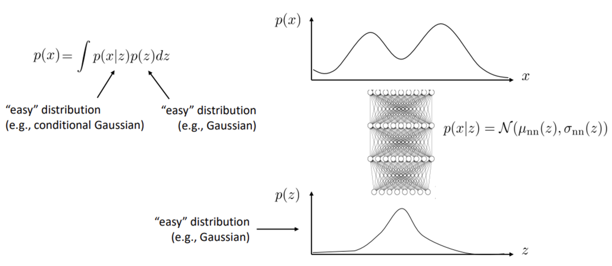
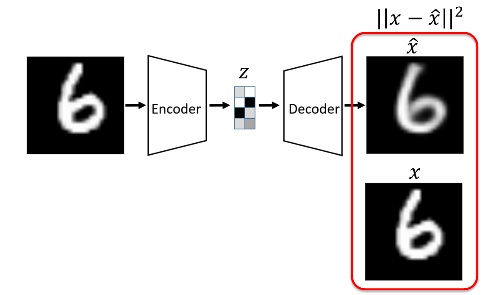
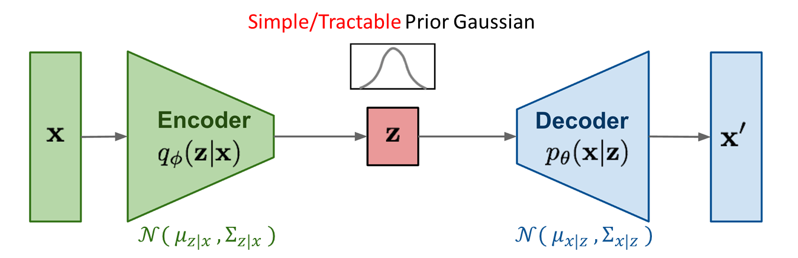
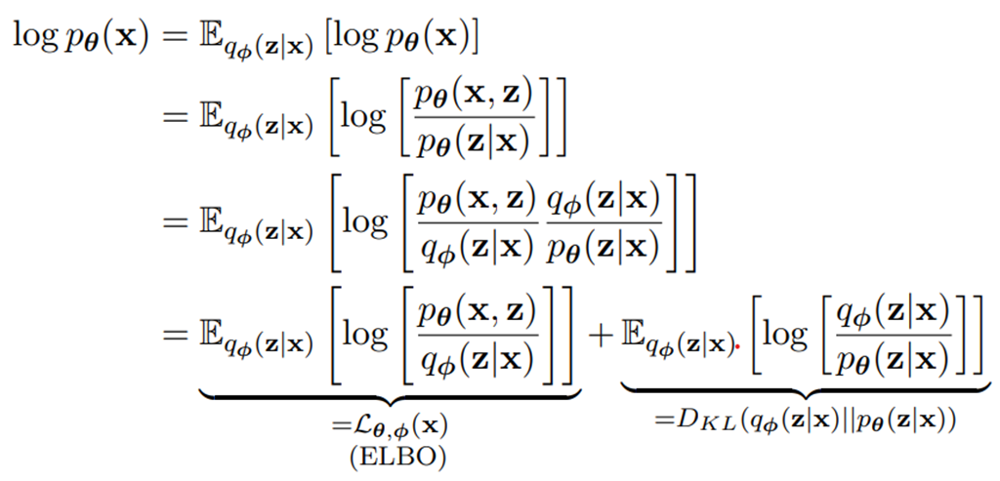
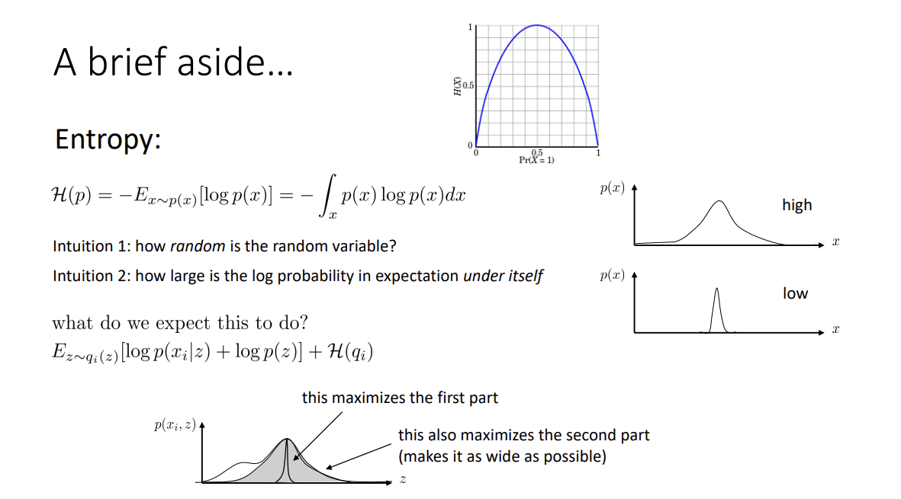

## 1. Notation

| Symbol | Mean |
| --- | --- |
| $D$ | $n$개의 data sample을 가진 dataset, $D = \{x^1, x^2,…, x^n\}$ |
| $x^i$ | 각 data point는 $d$차원의 vector이다. $x^i = [x_1^i, x_2^i,…, x_d^i]$ |
| $x$ | dataset $D$에 속한 한 data sample, $x\in D$ |
| $x', \hat{x}$ | $x$의 reconstructed version(생성된 sample) |
| $\tilde{x}$ | $x$의 corrupted version |
| $z$ | bottleneck layer의 결과인 compressed code**(latent vector)** |
| $a_j^l$ | $l$번째 layer의 $j$번째 neuron의 activation function |
| $g_{\phi}()$ | $\phi$로 parameterized된 **encoding** function |
| $f_{\theta}()$ | $\theta$로 parameterized된 **decoding** function |
| $q_{\phi}(z\mid x)$ | **probabilistic encoder**로, estimated **posterior** probability function이다. |
| $p_{\theta}(x\mid z)$ | probabilistic decoder로, 주어진 $z$(latent vector)를 이용해 $x$(true data)를 생성할 **likelihood**이다. |

## 2. Latent variable model

### 2.1 - latent variable

- `latent variable`(잠재 변수)는 구성 개념(Construct)이 직접적으로 관찰되거나 측정되지 않는 변수를 의미한다.
  
    → latent variable 자체로 전체 통계량을 측정하는 것은 불가능하기 때문에 observed variable(관측 변수)에 의해 간접적으로 통계 측정(수학적 modelling)을 수행해 추론한다.
    
    - **hidden variables** :  물리적으로는 측정될 수 있으나 실질적으로 측정되지 않는 경우의 latent variables를 hidden variables라고 한다.
    - hypothetical variables : data 구조, 범주, 행동, 정신 상태 등의 추상적 개념의 latent variables.

### 2.2 - Latent variable model

- 보편적인 Latent variable model : latent variable을 `unsupervised` manner로 학습하기 위해 neural network를 이용한다. 이 때, latent space $z$의 차원은 data $x$보다 축소되는데, feature가 의미있는 요소만 capture하기 위해서이다.
  
    일반적인 연속 분포에 대해 latent variable model은 아래 그림과 같이 두 distribution의 곱의 integral으로 나타난다. 
    
    
    
    $p(x)$는 복잡한 분포이고, $p(z)$와 $p(x\mid z)$는 Gaussian 분포와 같은 쉬운 분포를 사용한다. 이 때, $p(x\mid z)$의 mean과 variance는 $z$의 어떤 neural network function이고, 학습 가능하다.
    
    → $p(x)$는 복잡한 분포이기 때문에 이를 학습하는 것은 어렵다. 따라서 간단한 2개의 분포의 composition으로 나타내서 modelling problem을 보다 쉽게 만든다.
    

## 3. Variational Auto Encoder

### 3.1 - Auto-Encoder(AE)

- Auto-Encoder : unlabeled training data로부터 저차원의 feature representation을 학습하 위한 `Unsupervised approach` 이다. 따라서 Encoder를 학습하는 것이 AE의 목적이다.
    - latent space $z$에 대한 가정이 없다.
    - reconstruction error로 L2 loss function을 사용한다.
    - training 과정에서 label이 사용되지 않는다.
    - large, unlabeled dataset을 small, labeled dataset으로 transfer한다.
      
        
    
- Auto-Encoder는 data generation이 불가능하다.
  
    ⇒ latent space $z$에 대한 가정이 없고, $p(z)$의 exact distribution에 대해 알지 못하기 때문에 $p(z)$로부터 sample을 생성할 수 없다.
    

### 3.2 - Variational Auto-Encoder(VAE)

- **Variational Auto-Encoder** : generative model의 한 종류로, input data $x$로부터 latent vector $z$를 sampling하여 input data와 비슷한 output data $x'$을 만드는 것을 목표로 한다.
  
    
    
    - **Encoder** 과정 : $q_{\phi}(z\mid x)$
      
         latent vector $z$를 $p(z)$(=Prior)에서 sampling하는 대신, $x$와 최대한 비슷한 data를 생성하고자 이상적인 확률 분포인 $p_{\theta}(z\mid x)$(=Posterior)에서 sampling하고자 한다.
         
        그러나 $p_{\theta}(z\mid x)$를 모르기 때문에 **Variational Inference**를 이용하여 $q_{\phi}(z\mid x)$를 추정한다. 이후, 이 분포에서 $z$를 sampling한다.
        
        > `Variational Inference` : $q_{\phi}(z\mid x)$를 가정하고 이 분포의 parameter $\phi$를 학습시켜 이상적 확률 분포에 Approximation하는 방법이다. 이때, $q_{\phi}$는 정규분포라고 가정한다.
        > 
    - **Decoder** 과정 : $p_{\theta}(x\mid z)$
      
        Encoder로부터 sampling된 latent variable $z$를 입력하여 original data $x$와 비슷한 reconstructed data $x'$을 생성한다. Decoder는 이 둘의 차이를 최소화하는 $p_{\theta}(x\mid z)$를 모델링한다.
    
- **VAE의 training 과정**
    1. model과 data에 대해 maximum likelihood가 되는 parameter를 찾고, parameter를 maximum likelihood estimation을 통해 update한다.
    2. log값을 취해 log-likelihood로 식을 바꿔준다. 이 때, $z$는 `intractable`하기 때문에 적분이 불가능하다. 따라서 log-likelihood 대신에 `expected log-likelihood`를 **maximize**한다.
       
        $$
        \DeclareMathOperator*{\argmax}{arg\,max}
        \begin{align*} &the\,\,model: p_{\theta}(x)\\&the\,\,data: D=\{x_1,x_2,x_3,\dots,x_n\} \\ &maximum\,\,likelihood\,\,fit:\\ &\theta\leftarrow \underset{\theta}{\argmax}\,p_{\theta}(x)\quad(x_i:independent) \\ &\,\,\,\,=\underset{\theta}{\argmax}\,\prod_i p_{\theta}(x_i)\\ &\,\,\,\,=\underset{\theta}{\argmax}\,\log\prod_i p_{\theta}(x_i)\quad (log-likelihood)\\ &\,\,\,\,=\underset{\theta}{\argmax}\,\frac{1}{N} \log\prod_i p_{\theta}(x_i)\quad(\div N)\\&\,\,\,\,=\underset{\theta}{\argmax}\,\frac{1}{N}\sum_i \log p_{\theta}(x_i) \\ &이\,때,\,p_{\theta}(x_i)=\int p(x_i\mid z)p(z)dz\,\leftarrow z\,\,is\,\,intractable \end{align*}
        $$
        
    3. $z$가 무엇인지 모르기 때문에 $p_{\theta}(z\mid x_i)$를 이용해 주어진 $x_i$에 대해 가장 그럴듯한 $z$를 찾아 joint probability를 maximize한다. 실제 사용 시에는 $x$의 일부를 sampling하여 적용한다.
       
        $p_{\theta}(z\mid x_i)$를 구하는 것을 probabilistic inference라고 하는데, 어떤 $z$가 $x_i$로 가는지 inferring한다. VAE에서는 training data $x$의 분포와 최대한 가까운 데이터를 생성하기 위해서 $p_{\theta}(z\mid x_i)$를 구한다.
        
        $$
        \begin{align*}&expected\;log-likelihood: \\&\theta\leftarrow \underset{\theta}{\argmax}\,\frac{1}{N}\sum_i \log p_{\theta}(x_i)\\&\;\;=\underset{\theta}{\argmax}\,\mathbb{E}_{x\sim p_{\theta}(x)}[\log p_{\theta}(x)] \\ &\;\;=\underset{\theta}{\argmax} \,\mathbb{E}_{z\sim p_{\theta}(z\mid x)}[\log p_{\theta}(x)] \end{align*}
        $$
        
    4. 실제 $p_{\theta}(z\mid x_i)$의 분포를 모르기 때문에 다른 분포를 이용해 approximate한다. 예를 들어, 각 $x_i$마다 각각의 mean, variance를 이용해 만든 새 분포 $q_{\phi}(z\mid x_i)$를 사용해 $p_{\theta}(z\mid x_i)$를 estimate(추정)한다. 이 때, $q_{\phi}(z\mid x_i)$는 정규분포로 가정한다. 정규분포로 가정한 이유는, 정규분포끼리는 KL-Divergence를 계산하기 쉽기 때문이다.
       
        $$
        \begin{align*}&\theta\leftarrow \underset{\theta}{\argmax} \,\mathbb{E}_{z\sim p_{\theta}(z\mid x)}[\log p_{\theta}(x)]\\ &\;\;\,= \underset{\theta}{\argmax} \,\mathbb{E}_{z\sim q_{\phi}(z\mid x)}[\log p_{\theta}(x)]\\&q_{\phi}(z\mid x)\sim N(\mu_i, \sigma_i^2I) \end{align*}
        $$
        
    5. 따라서, $\log p_{\theta}(x)$를 $E_{q_{\phi}(z\mid x)}[\log p_{\theta}(x)]$로 나타낼 수 있다. 이 때, **bayes’ theorem**에 의해 이 식을 [아래]와 같이 변형할 수 있다. 결과적으로 두 개의 expected log-likelihood로 나타나는데, 각각 ELBO(Evidence Lower Bound)와 $q_{\phi}$와 $p_{\theta}$에 대한 KL-Divergence이다.
       
        > $Bayes \;Theorem : p_{\theta}(z\mid x)=\frac{p_{\theta}(x,z)}{p_{\theta}(x)}, \;\therefore p_{\theta}(x)=\frac{p_{\theta}(x,z)}{p_{\theta}(z\mid x)}$
        > 
        
        
        
    6. 이 때, ELBO에 대해 식을 정리하면 아래와 같은 식을 얻을 수 있는데, KL-Divergence는 항상 양수이므로 **ELBO는 log-likelihood $\log \,p_{\theta}(x)$의 lower bound**임을 알 수 있다. 따라서 **ELBO를 maximize함으로써 likelihood 또한 maximize**할 수 있다.
       
        
        
    7. ELBO를 변형하여 아래와 같이 두 개의 term으로 분리할 수 있다.
        - $-E_{z \sim q_{\phi}( z \mid x)} \left [ \log p_{ \theta }(x \mid z) \right]$ , `Reconstruction Error` : $q_{\phi}(z\mid x)$에서 sampling한 $z$에 대해 log-likelihood를 maximize하는 것이 목표이고, 이 때 Reconstruction Error를 minimize할 수 있다.
          
             이 error가 가진 의미는 VAE가 생성한 $x'$이 input data $x$와 얼마나 가까운지를 의미하고, VAE의 목표를 잘 달성하도록 한다.
            
        - $D_{KL}\left( {q_{\phi}(z\mid x)} \Vert{p_{\theta}(z)}\right)$, `Regularization Error` : posterior $q_{\phi}(z\mid x)$와 prior $p_{\theta}(z)$ (=Standard Normal Distribution) 간의 KL-divergence이다. 따라서 둘이 비슷할 수록 작아진다.
          
             이 error가 가진 의미는 Encoder가 출력하는 latent variable $z$의 분포를 Standard Normal Distribution에 가깝게 유지하도록 제약을 가해 Overfitting을 방지하고 latent space를 잘 구조화하여 일반화 능력을 향상시키도록 한다.
        
    
        $$
        \begin{align*} \mathcal{L}_{\theta,\phi}(x) &=\mathbb{E}_{q_{\phi}(z\mid x)}\left [\log\frac{p_{\theta}(x,z)}{q_{\phi}(z\mid x)}\right]\\ &=\mathbb{E}_{q_{\phi}(z\mid x)} \left [\log p_{\theta}(x,z) - q_{\phi}(z\mid x) \right]\\&= \mathbb{E}_{q_{\phi}(z\mid x)} \left[ \log p_{\theta}(x,z)-\log p_{\theta}(z)+\log{p_{\theta}(z)} - q_{\phi}(z\mid x) \right] \\ &=\mathbb{E}_{q_{\phi}(z\mid x)} \left [\log p_{\theta}(x\mid z) \right] - \mathbb{E}_{q_{\phi}(z\mid x)}\left[ \log \frac{q_{\phi}(z\mid x)}{p_{\theta}(z)}\right]\\ &=\mathbb{E}_{z \sim q_{\phi}(z\mid x)} \left [\log p_{\theta}(x\mid z) \right] - D_{KL}\left( {q_{\phi}(z\mid x)} \Vert{p_{\theta}(z)}\right) \end{align*}
        $$
    
- **Reparametrization Trick**
  
    training을 할 때, 위에서 구한 VAE의 parameter $\theta,\phi$를 Stochastic Gradient-based optimization을 통해 update를 해야한다. 그러나 아래의 식에서 볼 수 있듯이 $\phi$는 gradient를 구하기 어렵다. 
    
     따라서 $z$를 $q_{\phi}(z\mid x)$에서 직접 sampling하지 않고, $\epsilon$을 sampling하여 $z=u_{\phi}(x)+\Sigma_{\phi}(x)\times\epsilon$ 을 구한다. 이를 reparametrization trick이라고 한다.
    

## A. appendix

### A.1 - Gaussian Distribution(term)

- $x\sim N(0,1)$ : 확률분포 X가 평균이 0, 표준편차가 1일 때
- $x\sim N(0,I)$ : $I$는 단위 행렬으로, 주대각선의 원소가 모두 1이고 나머지는 0인 정사각 행렬이다. 따라서 $x_1, x_2,\dots,x_n$이 독립이고 모두 $N(0,1)$일 때를 뜻한다.

### A.2 - Monte Carlo Sampling

- Monte Carlo Sampling : 반복된 random sampling을 이용해 함수의 값을 근사하는 알고리즘이다.
    - 조건 : (independent and identically distribution=i.i.d.), 독립적이고 같은 확률 분포를 가지는 distribution
        - 독립적(independent) : 각 사건이 다른 사건에 영향을 주지 않는다.
        - 같은 확률 분포(identically) : 주사위 굴리기처럼 각 확률이 동일함을 의미한다.
    
    
    
    ⇒ 확률 변수가 상호독립적일때, 모두 동일한 확률 분포를 가진다면 기대값을 random하게 뽑은 N개 sample의 평균과 유사하다. (N이 커질수록 더욱 유사해진다.
    

### A.3 - Entropy

- Entropy : [2.2-Latent variable model]의 식에서는 log probability의 expectation의 음수를 뜻하며, **불확실성**을 의미한다.
    - Entropy의 정의 : $H(p)=-E_{x\sim p(x)}[log\,p(x)]$
    
    
    
    - H(p)에서 만약 p가 uniform distribution이라면 모든 확률이 같아 불확실성이 최대이고, entropy도 최대이다.
    - 반면, p가 one-hot distribution과 같이 어느 한 가지의 확률이 1, 나머지가 0인 경우에는 반드시 특정한 결과가 나오기 때문에 불확실하지 않다. 따라서 entropy는 최소이다.
    
    > 따라서 Entropy는 random variable이 얼마나 random한지를 나타낸다.
    > 

### A.4 - KL-Divergence

- KL-Divergence : 두 분포가 얼마나 차이나는지를 나타내는 값이다. 어떤 이상적인 분포에 대해, 그 분포를 근사하는 다른 분포를 사용해 sampling을 한다면 발생할 수 있는 정보 entropy 차이를 계산한다. KL-Divergence의 정의는 아래와 같다.
    - Discrete distribution & Continuous distribution :
      
        $$
        D_{KL}(p\mid \mid q)=E_{x\sim p(x)}\left(log\frac{p(x)}{q(x)}\right)=\sum\limits_{k=1}^Kp_klog\frac{p_k}{q_k} \\= \int p(x)\,log\frac{p(x)}{q(x)}\,dx = H(p,q) - H(p)
        $$
        
        위 식에서 p는 실제 분포, q는 추정한 분포를 의미한다. 위의 식에서 p와 q가 유사할수록 KL-Divergence의 값은 작아지게 된다. 따라서 딥러닝에서 model의 KL-Divergence가 **작아지도록** 학습을 진행하게 된다.
    
- KL-Divergence의 특징
    - $KL(p\mid \mid q)\ge 0$ : KL-Divergence는 **항상 0 이상**이다. 직관적으로, KL-Divergence는 Cross-entropy에서 entropy를 뺀 값이다. 이 때, Cross-entropy의 lower bound는 entropy이기 때문에, 즉 q가 p가 될 때 최솟값인 H(p)를 가져 KL-Divergence가 0이 된다. 이는 직관적인 방법으로, 수학적으로 증명하기 위해서는 Jensen’s Inequality를 이용하면 된다.
      
        > Jensen’s inequality : $log\,E(y)\geq E(log\,y)$
        > 
        
        $$
        KL(p\mid\mid q)=−∫p(x)\log{\frac{q(x)}{p(x)}}dx≥−\log ∫p(x)\frac{q(x)}{p(x)}dx= -\log ∫q(x)dx = -\log 1 = 0 \\ \therefore KL(p\mid\mid q) \ge 0
        $$
        
    - $KL(p\mid \mid q)\ne KL(q\mid \mid p)$ : KL-Divergence는 **거리 개념이 아니다**. 따라서 비대칭적이다. 수학적 증명은 아래와 같다.
      
        $$
        KL(p\mid\mid q) = H(p,q) - H(p) \\
         \neq H(q, p) - H(q) = KL(q\mid\mid p)
        \\
         \therefore KL(p\mid\mid q) \neq KL(q\mid\mid p)
        $$